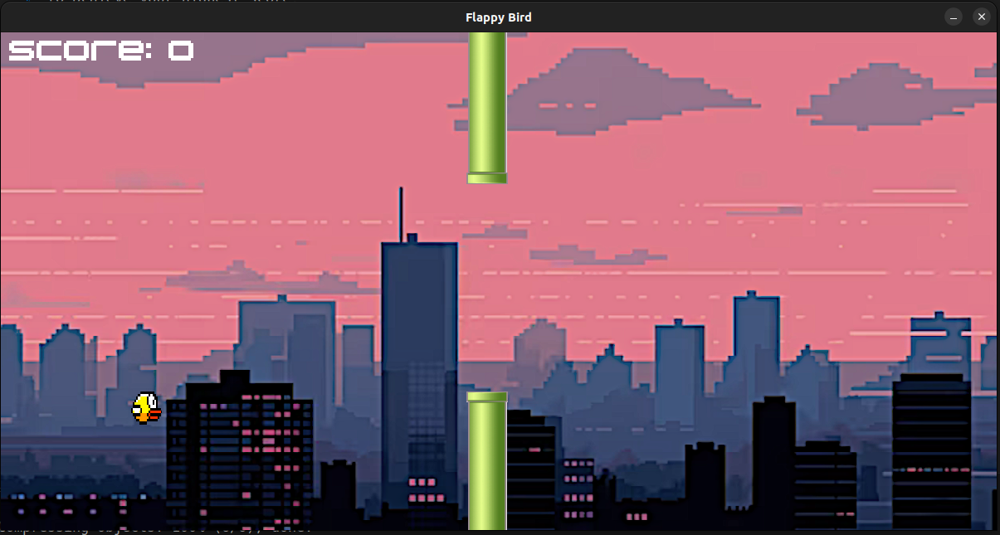

# Flappy Bird Clone

This is a simple clone of the popular game "Flappy Bird" developed using the SDL2 library. Navigate the bird through the pipes and try to achieve your highest score!



## Features

- Classic Flappy Bird gameplay mechanics
- Pipe collision detection
- Scoring system
- Simple 2D graphics

## Dependencies

- SDL2
- SDL2_image
- SDL2_ttf (if you have text rendering)
- SDL2_mixer (if you added sound effects/music)

## Building and Running

1. Install the required dependencies:

   ```bash
   sudo apt-get install libsdl2-dev libsdl2-image-dev libsdl2-ttf-dev libsdl2-mixer-dev
   ```

2. Clone this repository:

   ```bash
   git clone https://github.com/yourusername/flappy-bird-clone.git
   cd flappy-bird-clone
   ```

3. Build the game:

   ```bash
   make
   ```

4. Run the game:

   ```bash
   ./game
   ```

## Controls

- **Space** or **Left Mouse Button** : Flap
- **R**: Restart
- **Esc**: Quit

## License

This project is licensed under the GNU General Public License - see the [LICENSE.md](LICENSE.md) file for details.
